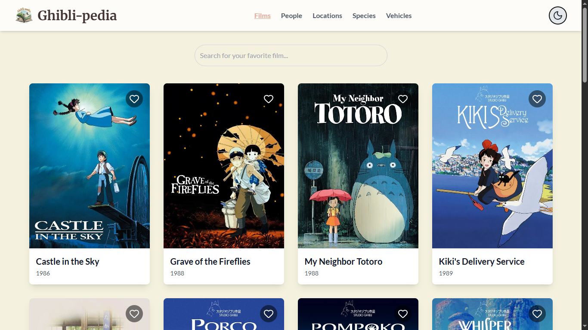
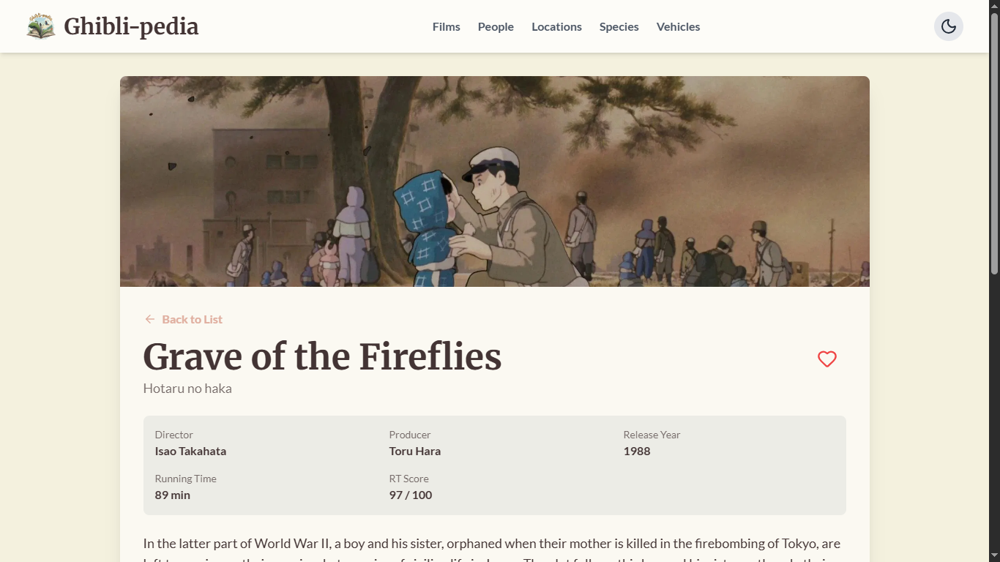

# Ghibli-pedia 🎬

Selamat datang di Ghibli-pedia, sebuah ensiklopedia mini yang didedikasikan untuk dunia magis dari Studio Ghibli. Proyek ini dibuat dengan penuh cinta menggunakan React dan Ghibli API.

#### Halaman depan

#### Halaman detail


## ✨ Fitur-fitur

-   **Daftar Film Lengkap:** Menampilkan semua 22 film dari Studio Ghibli.
-   **Pencarian Interaktif:** Cari film favoritmu dengan mudah.
-   **Halaman Detail Komprehensif:** Lihat detail lengkap setiap film, termasuk karakter, lokasi, dan kendaraan yang muncul.
-   **Kategori Tambahan:** Jelajahi daftar lengkap Karakter, Lokasi, Spesies, dan Kendaraan dari dunia Ghibli.
-   **Sistem Favorit:** Tandai film-film yang kamu sukai dan datanya akan tersimpan di browser.
-   **Mode Gelap & Terang:** Ubah tema sesuka hati untuk kenyamanan membaca.
-   **Desain Responsif:** Tampilan yang rapi dan fungsional di perangkat desktop maupun mobile.
-   **Animasi Halus:** Transisi antar halaman yang mulus dan elegan.

## 🛠️ Teknologi yang Digunakan

-   **Framework:** React (dengan Vite)
-   **Styling:** Tailwind CSS
-   **Data Fetching:** Axios
-   **Routing:** React Router DOM
-   **Animasi:** Framer Motion
-   **Ikon:** Lucide React
-   **API:** [Ghibli API](https://ghibliapi.vercel.app/)

## 🚀 Instalasi & Menjalankan Proyek

Ingin menjalankan proyek ini di komputermu? Ikuti langkah-langkah berikut:

1.  **Clone repositori ini:**
    ```sh
    git clone https://github.com/ofikur/ghibli-pedia.git
    ```

2.  **Masuk ke direktori proyek:**
    ```sh
    cd ghibli-pedia
    ```

3.  **Install semua dependencies:**
    ```sh
    npm install
    ```

4.  **Jalankan development server:**
    ```sh
    npm run dev
    ```

Buka `http://localhost:5173` di browsermu dan nikmati petualangannya!